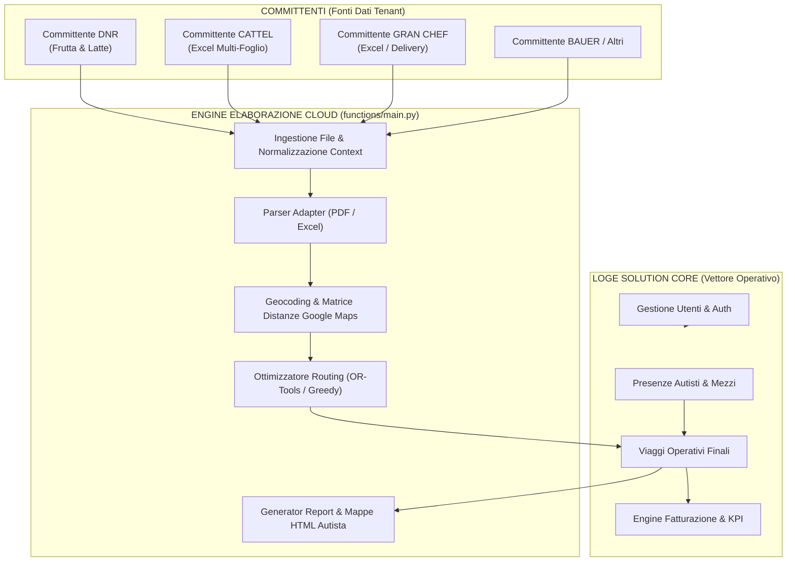
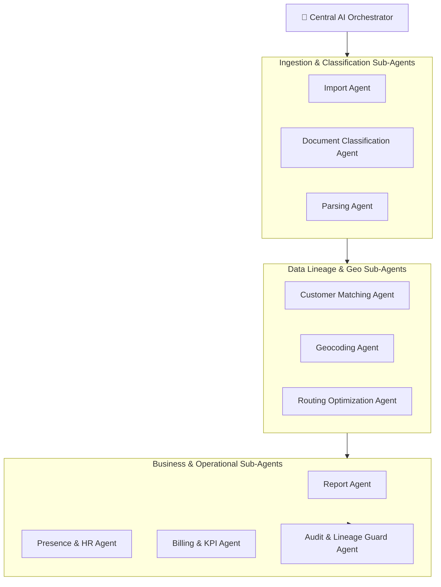

# 🏛️ Blueprint Architetturale Ufficiale — AppLogSolutionsWeb

> **Piattaforma Logistica Modulare e Multi-Committente Dual Mode**  
> **Proprietà**: Loge Solution (Vettore Operativo)  
> **Stato Documento**: SINGLE SOURCE OF TRUTH ARCHITETTURALE (v4.2 Enterprise DDD Edition)  
> **Ultimo Aggiornamento**: Luglio 2026

---

## 📑 INDICE DEL BLUEPRINT

1. [Scopo e Principi di Verifica](#1-scopo-e-principi-di-verifica) `[STATO ATTUALE CONFERMATO]`
2. [Visione del Progetto](#2-visione-del-progetto) `[EVOLUZIONE FUTURA]`
3. [Identità Aziendale, Bounded Contexts e Ruoli](#3-identità-aziendale-bounded-contexts-e-ruoli) `[STATO ATTUALE CONFERMATO]`
4. [Principi Architetturali Vincolanti](#4-principi-architetturali-vincolanti) `[ARCHITETTURA TARGET APPROVATA]`
5. [Source of Truth dei Dati](#5-source-of-truth-dei-dati) `[STATO ATTUALE PARZIALE]`
6. [Ecosistema del Sistema](#6-ecosistema-del-sistema) `[STATO ATTUALE PARZIALE]`
7. [Architettura Tecnica Attuale](#7-architettura-tecnica-attuale) `[STATO ATTUALE CONFERMATO]`
8. [Pipeline Ufficiale dei Dati](#8-pipeline-ufficiale-dei-dati) `[STATO ATTUALE PARZIALE]`
9. [Pipeline Specifiche: DNR Frutta e Latte](#9-pipeline-specifiche-dnr-frutta-e-latte) `[STATO ATTUALE CONFERMATO]`
10. [Pipeline Specifiche: CATTEL, GRAN CHEF e Altri](#10-pipeline-specifiche-cattel-gran-chef-e-altri) `[STATO ATTUALE CONFERMATO]`
11. [Punti di Consegna e Modello Geografico](#11-punti-di-consegna-e-modello-geografico) `[DEBITO TECNICO]`
12. [Identità della Fermata (pointUUID)](#12-identità-della-fermata-pointuuid) `[IPOTESI DA VALIDARE]`
13. [Modello dei Viaggi (Iniziali, Operativi, Commerciali, Fatturabili)](#13-modello-dei-viaggi-iniziali-operativi-commerciali-fatturabili) `[DEBITO TECNICO]`
14. [Documenti di Viaggio (Originali vs Placeholder)](#14-documenti-di-viaggio-originali-vs-placeholder) `[STATO ATTUALE PARZIALE]`
15. [Presenze e Operatività Autisti](#15-presenze-e-operatività-autisti) `[STATO ATTUALE CONFERMATO]`
16. [Fatturazione e Valore Commerciale](#16-fatturazione-e-valore-commerciale) `[STATO ATTUALE PARZIALE]`
17. [Architettura Offline-First](#17-architettura-offline-first) `[STATO ATTUALE PARZIALE]`
18. [Architettura delle Mappe e Routing](#18-architettura-delle-mappe-e-routing) `[STATO ATTUALE CONFERMATO]`
19. [Firestore Data Architecture](#19-firestore-data-architecture) `[DEBITO TECNICO]`
20. [Cloud Storage Architecture](#20-cloud-storage-architecture) `[DEBITO TECNICO]`
21. [Security, Autenticazione e Ambienti](#21-security-autenticazione-e-ambienti) `[STATO ATTUALE CONFERMATO]`
22. [Architettura Target AI (Orchestratore e Sub-Agenti)](#22-architettura-target-ai-orchestratore-e-sub-agenti) `[EVOLUZIONE FUTURA]`
23. [Principi per gli Agenti AI Futuri](#23-principi-per-gli-agenti-ai-futuri) `[EVOLUZIONE FUTURA]`
24. [Roadmap Architetturale](#24-roadmap-architetturale) `[ARCHITETTURA TARGET APPROVATA]`
25. [Debito Tecnico Principale](#25-debito-tecnico-principale) `[DEBITO TECNICO]`
26. [Decision Log Architetturale (ADR)](#26-decision-log-architetturale-adr) `[STATO ATTUALE CONFERMATO]`
27. [Glossario e Matrice Terminologica](#27-glossario-e-matrice-terminologica) `[STATO ATTUALE CONFERMATO]`
28. [Documenti Correlati](#28-documenti-correlati) `[STATO ATTUALE CONFERMATO]`

---

## 1. SCOPO E PRINCIPI DI VERIFICA `[STATO ATTUALE CONFERMATO]`

### 1.1 Scopo del Blueprint
`ARCHITECTURE.md` è il **documento unico di riferimento tecnico (Single Source of Truth)** per la piattaforma AppLogSolutionsWeb. Disciplina la struttura attuale del software, isola il debito tecnico esistente e definisce la traiettoria di evoluzione futura verso un'architettura multi-tenant ed AI-orchestrated.

### 1.2 Tassonomia delle Classificazioni Obbligatorie
Ogni sezione e concetto all'interno di questo blueprint è tassativamente marcato con uno dei 6 livelli di maturità architetturale:
* `[STATO ATTUALE CONFERMATO]`: Funzionalità verificata empiricamente nel codice sorgente (`frontend/`, `functions/main.py`, `.firebaserc`).
* `[STATO ATTUALE PARZIALE]`: Funzionalità presente ed operativa ma limitata in alcuni scenari o incompleta.
* `[DEBITO TECNICO]`: Componente operativamente funzionante ma con rigidità, hardcoding o asimmetria strutturale.
* `[ARCHITETTURA TARGET APPROVATA]`: Modello futuro formalizzato ed approvato per i successivi sviluppi.
* `[EVOLUZIONE FUTURA]`: Visione a lungo termine (es. Orchestratore AI e Sub-agenti autonomi).
* `[IPOTESI DA VALIDARE]`: Proposta di sviluppo che richiede test di fattibilità sui dati reali prima dell'approvazione.

---

## 2. VISIONE DEL PROGETTO `[EVOLUZIONE FUTURA]`

**AppLogSolutionsWeb** non è un semplice gestionale monolitico di bolle.  
È una **piattaforma logistica modulare di proprietà di Loge Solution**, concepita per governare il ciclo di vita end-to-end del servizio distributivo su strada:
1. Ingestione ed elaborazione automatica delle bolle e dei DDT dei committenti (PDF, Excel, TXT);
2. Geolocalizzazione, raggruppamento e ottimizzazione degli itinerari via Google Maps ed OR-Tools;
3. Assegnazione operativa dei viaggi ai veicoli ed agli autisti di Loge Solution;
4. Esecuzione sul campo tramite mappe interattive e tracciamento dello stato delle consegne via Web App;
5. Gestione del personale, presenze autisti, navette e riepilogo ore lavorate;
6. Fatturazione contabile dei corrispettivi spettanti al vettore e rendicontazione dei KPI;
7. Archiviazione storica e magazzino dati R&D.

---

## 3. IDENTITÀ AZIENDALE, BOUNDED CONTEXTS E RUOLI `[STATO ATTUALE CONFERMATO]`

In linea con i principi di Domain-Driven Design (DDD), il sistema separa nettamente i due domini principali:

### 3.1 Bounded Context 1: Loge Solution (Società Proprietaria e Vettore Operativo)
Loge Solution è la società che detiene la proprietà della piattaforma tecnologica ed esegue il trasporto merci. Loge Solution governa:
* L'applicazione web, i server ed i servizi Cloud Functions;
* La flotta veicoli (targhe, capienza, manutenzioni);
* Il personale autisti (presenze, turni, straordinari, ferie);
* Le sedi aziendali, magazzini e punti di partenza/rientro dei viaggi (deposito);
* La pianificazione dei **Viaggi Operativi Finali**;
* La fatturazione dei servizi di trasporto emessa verso i committenti.

### 3.2 Bounded Context 2: Committenti / Clients (Tenants Paritetici)
I committenti (**DNR, CATTEL, GRAN CHEF, BAUER, HOTEL**, ecc.) sono i clienti commerciali di Loge Solution. I committenti:
* Forniscono le merci ed i documenti di trasporto (DDT, ordini, file sorgente PDF/Excel);
* Forniscono le anagrafiche dei propri clienti finali e i punti di destinazione;
* Richiedono vincoli orari e istruzioni di consegna;
* NON possiedono la piattaforma software;
* **DNR è un committente cliente come gli altri e NON è il tenant radice o proprietario dell'app**.

---

## 4. PRINCIPI ARCHITETTURALI VINCOLANTI `[ARCHITETTURA TARGET APPROVATA]`

1. **Data Lineage Immutabile**: Nessun punto di consegna o documento può perdere l'indicazione del committente d'origine (`tenantId`) dall'importazione alla fatturazione.
2. **Separazione Tassonomica dei Concetti**:
   * `tenantId`: Identificativo del committente (`"DNR"`, `"CATTEL"`, `"GRAN CHEF"`).
   * `sourceChannel`: Canale documentale sorgente (`"FRUTTA"`, `"LATTE"`, `"EXCEL_CATTEL"`).
   * `parserType`: Adattatore di parsing (`"PDF_DNR"`, `"XLS_CATTEL"`).
   * `zonaLogistica`: Area geografica distributiva (`"ZONA 1"`, `"CATTEL MESTRE"`).
   * `puntoDiConsegna`: Destinazione fisica sul territorio (Indirizzo / Coordinate GPS).
3. **Canali DNR**: `DNR_FRUTTA` e `DNR_LATTE` sono rappresentati come `tenantId = "DNR"` con `sourceChannel = "FRUTTA"` o `sourceChannel = "LATTE"`.
4. **Divieto Fallback Automatico**: Se un dato arriva senza `tenantId`, deve essere bloccato o posto in quarantena (`processing_jobs_quarantine`), **mai assegnato automaticamente a DNR**.
5. **Proprietà del Viaggio Operativo**: Il viaggio finale appartiene a Loge Solution e potrà contenere fermate di più committenti (viaggi misti), ma ogni singola fermata mantiene la propria appartenenza commerciale.

---

## 5. SOURCE OF TRUTH DEI DATI `[STATO ATTUALE PARZIALE]`

| Dominio Dati | Source of Truth | Natura Architetturale | Note e Visibilità |
| --- | --- | --- | --- |
| **Autisti e Personale** | Loge Solution | Globale Aziendale | Gestiti centralmente (`autisti`). Condivisi tra committenti. |
| **Automezzi e Targhe** | Loge Solution | Globale Aziendale | Gestiti centralmente (`automezzi`). Assegnati ai viaggi. |
| **Presenze e Orari** | Loge Solution | Globale Aziendale | Dati HR autisti (`presenze`). Proprietà Loge Solution. |
| **Utenti e Ruoli** | Loge Solution | Globale Aziendale | Autenticazione e ruoli di accesso (`users`). |
| **Anagrafica Punti DNR** | DNR | Tenant-Specifico | `clienti/DNR/raccolta clienti`. Codici cliente e note DNR. |
| **Anagrafica Punti Cattel**| CATTEL | Tenant-Specifico | `clienti/CATTEL/raccolta clienti`. Codici cliente Cattel. |
| **Anagrafica GranChef** | GRAN CHEF | Tenant-Specifico | `clienti/GRAN CHEF/raccolta clienti`. Codici GranChef. |
| **DDT e Documenti** | Committente | Tenant-Specifico | Merci, colli, peso, numero DDT. |
| **File Sorgente Importati**| Committente | Tenant-Specifico | PDF, Excel, TXT conservati nei bucket Storage. |
| **Viaggi Iniziali** | Sorgente Importata | Temporanei / Logici | Zone o giri proposti originariamente dai committenti. |
| **Viaggi Operativi Finali**| Loge Solution | Aziendale Operativo | Itinerari reali ottimizzati ed eseguiti dai veicoli. |
| **Fatturazione** | Loge Solution | Aziendale Commerciale| Rendicontazione corrispettivi spettanti al vettore. |
| **Cache Distanze GCP** | Loge Solution | Tecnica Globale | Cache condivisa delle matrici di distanza e percorsi reali. |

---

## 6. ECOSISTEMA DEL SISTEMA `[STATO ATTUALE PARZIALE]`



---

## 7. ARCHITETTURA TECNICA ATTUALE `[STATO ATTUALE CONFERMATO]`

### 7.1 Frontend (`frontend/`)
* **Tecnologia**: Single Page / Multi-Page App costruita in HTML5, JavaScript ES6 e CSS3 Vanilla.
* **Inizializzazione**: `frontend/core/firebase-init.js` seleziona la configurazione Dev (`log-solutions-cantiere`) o Prod (`log-solution-60007`) leggendo l'hostname via `frontend/firebase-config.js`.
* **Moduli Principali**:
  * `elaborazione.html` / `js/elaborazione.js`: Caricamento PDF/Excel, split DDT, merge Frutta/Latte, pianificazione.
  * `link_viaggi.html` / `js/link_viaggi.js`: Centrale operativa dual-mode (Viaggi attivi 60gg vs Archivio R&D).
  * `mappa_zone.html` & `mappa_google.html`: Ottimizzazione grafica e trascinamento tappe.
  * `presenze.html`, `gestione.html`, `fatturazione.html`: Gestione HR, mezzi e contabilità.

### 7.2 Backend Cloud Functions (`functions/main.py`)
* **Tecnologia**: Python 3.11 su Firebase Cloud Functions v2.
* **Struttura**: Monolito modulare accentrato in `functions/main.py` con helper in `functions/infrastructure/`.
* **Dynamic Config**: `infrastructure/firebase_setup.py` rileva `PROJECT_ID` e `BUCKET_NAME` dalle variabili d'ambiente GCP dell'istanza in esecuzione.

---

## 8. PIPELINE UFFICIALE DEI DATI `[STATO ATTUALE PARZIALE]`

```text
[Acquisizione File Input]
          │
          ▼
[1. Context Identification] ──► Normalizzazione rawTenant & rawSourceChannel
          │
          ▼
[2. Parsing Adapter] ────────► Estratti DDT, Punti, Merci, Colli, Peso, Orari
          │
          ▼
[3. Anagrafica & Geo] ───────► Geocoding Google Maps / Lookup Firestore Raccolta Clienti
          │
          ▼
[4. Raggruppamento Zona] ────► Assegnazione Zona Logistica (Viaggio Iniziale)
          │
          ▼
[5. Optimization Routing] ──► OR-Tools / Google Directions (Calcolo Sequenza Tappe)
          │
          ▼
[6. Salvataggio Firestore] ──► Creazione Documento Viaggio Operativo
          │
          ▼
[7. Generation Output] ──────► Generazione Distinta PDF & Link Mappa Autista HTML
          │
          ▼
[8. Fatturazione & KPI] ─────► Calcolo Corrispettivi & Archiviazione a Freddo (60gg+)
```

---

## 9. PIPELINE SPECIFICHE: DNR FRUTTA E LATTE `[STATO ATTUALE CONFERMATO]`

1. **Input**: PDF cumulativi per i canali `FRUTTA` (es. Progetto Scuole) o `LATTE`.
2. **Parsing**: `processa_job_pdf` in `main.py` estrae i singoli DDT via `pdfplumber`/`pypdf`.
3. **Salvataggio Storage**: Salva i DDT estratti in `split_ddt/{data_consegna}/`.
4. **Merge Fermata Fisica (Regola Commerciale DNR)**:
   * Se un cliente riceve nello stesso giorno sia DDT Frutta che Latte allo stesso indirizzo, il sistema unifica la sosta per l'autista sulla mappa.
   * L'unificazione **mantiene intatti tutti i DDT originali** all'interno dell'array del documento viaggio e sulla distinta.
   * *Esempio*: `100 DDT Frutta + 40 DDT Latte - 20 Coincidenti = 120 Fermate Fisiche`.

---

## 10. PIPELINE SPECIFICHE: CATTEL, GRAN CHEF E ALTRI `[STATO ATTUALE CONFERMATO]`

* **CATTEL**: Ingestione file Excel multi-foglio via `_processa_excel_cattel_core_logic`. Ogni foglio rappresenta un giro/zona logistica. Salva i report sotto `CATTEL/REPORTS/{data_consegna}/`.
* **GRAN CHEF**: Ingestione liste consegne GranChef. Raggruppamento per codice cliente GranChef.

---

## 11. PUNTI DI CONSEGNA E MODELLO GEOGRAFICO `[DEBITO TECNICO]`

Un **Punto di Consegna** è la destinazione fisica reaching sul territorio (es. bar, ristorante, scuola).  
`[DEBITO TECNICO]`: Attualmente, se Cattel e GranChef servono lo stesso ristorante allo stesso indirizzo, esistono due documenti distinti in Firestore (`clienti/CATTEL/raccolta clienti` e `clienti/GRAN CHEF/raccolta clienti`).

---

## 12. IDENTITÀ DELLA FERMATA (pointUUID) `[IPOTESI DA VALIDARE]`

`[DEBITO TECNICO / CRITICO]`: Nel codice attuale, l'ID di una fermata viene generato in modo volatile o basato sull'indice dell'array sequenziale. Se una fermata viene spostata tra due viaggi, perde la sua identità storica.

### Architettura Target Proposal (`pointUUID`):
Ogni fermata generata durante l'ingestione deve ricevere un **UUID immutabile** (`pointUUID`):
```json
{
  "pointUUID": "f81d4fae-7dec-11d0-a765-00a0c91e6bf6",
  "tenantId": "CATTEL",
  "sourceChannel": "EXCEL_CATTEL",
  "importJobId": "job_20260725_001",
  "customerCode": "157",
  "documentRefs": ["DDT_98451"]
}
```

---

## 13. MODELLO DEI VIAGGI (INIZIALI, OPERATIVI, COMMERCIALI, FATTURABILI) `[DEBITO TECNICO]`

1. **Viaggio Iniziale**: Raggruppamento o giro proposto dal committente (es. foglio Excel Cattel).
2. **Viaggio Operativo Finale**: Itinerario reale deciso ed eseguito dai veicoli Loge Solution.
3. **Viaggio Commerciale / Fatturabile**: Rendicontazione contabile del servizio reso al committente.
   * `[DEBITO TECNICO]`: Attualmente i viaggi sono memorizzati in Firestore sotto `clienti/{tenant}/viaggi ddt`. Questo impedisce i viaggi operativi multi-committente misti.
   * *Architettura Target*: Spostamento dei viaggi operativi a livello radice aziendale (`viaggi_operativi/{viaggio_id}`), con attributo `tenantId` memorizzato all'interno di ciascuna fermata dell'array.

---

## 14. DOCUMENTI DI VIAGGIO (ORIGINALI VS PLACEHOLDER) `[STATO ATTUALE PARZIALE]`

1. **`ORIGINAL_DDT`**: Documento PDF originale estratto dai file sorgente (es. DNR).
2. **`DELIVERY_PLACEHOLDER`**: Segnaposto A4 generato dal sistema quando il committente (es. Cattel / GranChef) consegna bolle cartacee fisiche.

---

## 15. PRESENZE E OPERATIVITÀ AUTISTI `[STATO ATTUALE CONFERMATO]`

* **Presenze HR**: Gestite nella collezione globale radice `presenze`. Registrano entrata, uscita, pausa, straordinari e giustificativi.
* **Assegnazione Mezzi & Navette**: L'autista seleziona il mezzo (`automezzi`) e la giornata logistica.
* **Separazione**: Le presenze appartengono a Loge Solution e sono totalmente indipendenti dai committenti.

---

## 16. FATTURAZIONE E VALORE COMMERCIALE `[STATO ATTUALE PARZIALE]`

* **Engine Fatturazione V2**: Calcola i corrispettivi dovuti dai committenti a Loge Solution.
* **Unità di Calcolo**: Giornata, viaggio, punto di consegna, numero DDT, colli, peso (kg), km percorsi, navette e supplementi.
* **Principio Inviolabile**: La riorganizzazione operativa dei viaggi non deve mai alterare il calcolo contabile dei servizi commerciali resi a ciascun committente.

---

## 17. ARCHITETTURA OFFLINE-FIRST `[STATO ATTUALE PARZIALE]`

* **IndexedDB & Persistent Cache**: Firestore SDK inizializzato con `persistentLocalCache` e `persistentMultipleTabManager` in `firebase-init.js`.
* **Offline Fallback**: Funzioni `getDocsConFallback()` e `getDocConFallback()` per garantire la lettura dei dati anche senza rete.

---

## 18. ARCHITETTURA DELLE MAPPE E ROUTING `[STATO ATTUALE CONFERMATO]`

* **Routing Engine**: Python `ortools` (Google OR-Tools) e Google Maps Directions API per il calcolo delle matrici di tempo/distanza.
* **Mappe Frontend**: Leaflet.js con OpenStreetMap e Google Maps JavaScript API.
* **Link WhatsApp Autisti**: Generazione di file HTML statici con mappe interattive salvati in Cloud Storage.

---

## 19. FIRESTORE DATA ARCHITECTURE `[DEBITO TECNICO]`

```text
Firestore Root
│
├── users/                     [Globale Aziendale Loge Solution]
├── autisti/                   [Globale Aziendale Loge Solution]
├── automezzi/                 [Globale Aziendale Loge Solution]
├── presenze/                  [Globale Aziendale Loge Solution]
├── viaggi/                    [Globale Operativo Autisti]
│
└── clienti/                   [Sottocollezioni Tenant-Specifiche]
    ├── DNR/
    │   ├── raccolta clienti
    │   ├── viaggi ddt
    │   ├── anagrafica_articoli
    │   └── rientri ddt
    ├── CATTEL/
    │   ├── raccolta clienti
    │   └── viaggi ddt
    └── GRAN CHEF/
        ├── raccolta clienti
        └── viaggi ddt
```

---

## 20. CLOUD STORAGE ARCHITECTURE `[DEBITO TECNICO]`

```text
Storage Bucket (log-solutions-cantiere / log-solution-60007)
│
├── split_ddt/{data}/          [PDF estratti dai job DNR]
├── REPORTS/{data}/            [Report fisici DNR (Asimmetria Legacy)]
├── CATTEL/REPORTS/{data}/     [Report fisici CATTEL]
├── GRAN CHEF/REPORTS/{data}/  [Report fisici GRAN CHEF]
├── caches/                    [Cache JSON matrici distanze]
├── caches_backup/             [Backup immutabili con timestamp]
└── ARCHIVIO_STORICO_RD/       [Archiviazione a freddo ultra-sessantennale]
```

---

## 21. SECURITY, AUTENTICAZIONE E AMBIENTI `[STATO ATTUALE CONFERMATO]`

* **Ambiente Sviluppo**: `log-solutions-cantiere`
* **Ambiente Produzione**: `log-solution-60007`
* **Governance Deploy**: Disciplinata nel documento vincolante [`AGENTS.md`](file:///H:/Il%20mio%20Drive/App/AppLogSolutionsWeb/AGENTS.md).

---

## 22. ARCHITETTURA TARGET AI (ORCHESTRATORE E SUB-AGENTI) `[EVOLUZIONE FUTURA]`



L'**Orchestratore Centrale AI** è una componente di evoluzione futura destinata a supervisionare l'ingestione ed il Data Lineage dei file ricevuti.

---

## 23. PRINCIPI PER GLI AGENTI AI FUTURI `[EVOLUZIONE FUTURA]`

1. **Contesto Esplicito**: Ricevere sempre `tenantId` e `sourceChannel` validati;
2. **Idempotenza**: Poter ri-eseguire un lavoro di parsing o routing senza duplicare i dati in Firestore;
3. **Quarantena Anomalie**: Spostare i record ambigui in `processing_jobs_quarantine` richiedendo l'intervento umano;
4. **Audit Trail**: Registrare ogni operazione con timestamp e modello utilizzato.

---

## 24. ROADMAP ARCHITETTURALE `[ARCHITETTURA TARGET APPROVATA]`

* **Fase A — Sicurezza Ambienti & Governance**: Messa in sicurezza CI/CD e CLI (in corso).
* **Fase B — Data Lineage & `pointUUID`**: Introduzione degli UUID immutabili per le fermate.
* **Fase C — Normalizzazione TenantContext**: Unificazione della gestione `tenantId`/`sourceChannel`.
* **Fase D — Viaggi Operativi Multi-Committente**: Migrazione dello schema viaggi a livello root aziendale.
* **Fase E — Uniformazione Storage**: Migrazione dei report DNR sotto `DNR/REPORTS/{data}/`.
* **Fase F — Engine Fatturazione V3**: Supporto nativo per tariffe dinamiche e viaggi misti.
* **Fase G — Orchestratore AI**: Introduzione del motore centrale di orchestrazione file.

---

## 25. DEBITO TECNICO PRINCIPALE `[DEBITO TECNICO]`

1. **🔴 CRITICO — Deploy Automatico GitHub Actions su Push Main**: Workflow `.github/workflows/deploy.yml` rilascia l'Hosting di Produzione su ogni push.
2. **🔴 CRITICO — Assenza `pointUUID` Fermata**: Perdita di Data Lineage durante lo spostamento o la divisione dei viaggi.
3. **🔴 CRITICO — Schema Viaggi Monocommittente**: Impossibilità di gestire viaggi operativi misti in Firestore.
4. **🟠 ALTO — Asimmetria Storage DNR**: DNR salva nella root `REPORTS/` anziché sotto `DNR/REPORTS/`.
5. **🟠 ALTO — Fallback Hardcoded DNR**: Presenza di `|| 'DNR'` nel backend Python e nel frontend JS.

---

## 26. DECISION LOG ARCHITETTURALE (ADR) `[STATO ATTUALE CONFERMATO]`

### ADR-001: Definizione del Modello Tenant Paritetico
* **Data**: Luglio 2026
* **Stato**: Approvata
* **Contesto**: DNR era trattato come tenant radice con privilegi strutturali nel codice.
* **Decisione**: DNR è ridimensionato a committente normale e paritetico. `DNR_FRUTTA` e `DNR_LATTE` diventano `tenantId = "DNR"` con `sourceChannel = "FRUTTA"` o `"LATTE"`.
* **Alternative Considerate**: Mantenere DNR come radice o dividere DNR in due tenant separati (scartate perché violano l'isolamento ed il data lineage).
* **Conseguenze**: Necessità di normalizzazione nei parser e rimozione dei fallback `|| 'DNR'`.
* **Rollback**: Mantenimento temporaneo delle funzioni di lettura legacy per garantire la compatibilità con i viaggi storici.
* **Migrazione**: Script di normalizzazione in sola lettura senza alterare i dati di produzione.

---

## 27. GLOSSARIO E MATRICE TERMINOLOGICA `[STATO ATTUALE CONFERMATO]`

| Termine | Definizione Architetturale | Valutazione Chiarezza |
| --- | --- | --- |
| **Loge Solution** | Società proprietaria della piattaforma tecnologica e vettore logistico operativo. | `[CHIARO]` |
| **Committente / Tenant** | Cliente aziendale che commissiona i trasporti (DNR, Cattel, GranChef, Bauer). | `[CHIARO]` |
| **tenantId** | Identificativo univoco del committente (es. `"DNR"`, `"CATTEL"`). | `[CHIARO]` |
| **sourceChannel** | Canale documentale sorgente (es. `"FRUTTA"`, `"LATTE"`, `"EXCEL_CATTEL"`). | `[CHIARO]` |
| **zonaLogistica** | Area geografica o giro distributivo (es. `"ZONA 1"`, `"CATTEL MESTRE"`). | `[CHIARO]` |
| **puntoDiConsegna** | Destinazione fisica sul territorio identificata da indirizzo e coordinate GPS. | `[DA MIGLIORARE]` (Sovrapposto al codice cliente) |
| **fermata** | Sosta fisica del veicolo per consegnare merce a uno o più DDT nello stesso punto. | `[AMBIGUO]` (Spesso confuso con la tappa o il punto) |
| **viaggioIniziale** | Raggruppamento logico o zona proposta originariamente dal committente. | `[AMBIGUO]` (Sovrapposto alla zona) |
| **viaggioOperativoFinale** | Itinerario reale deciso ed eseguito dai veicoli Loge Solution. | `[CHIARO]` |
| **ORIGINAL_DDT** | Documento PDF originale estratto dai file sorgente. | `[CHIARO]` |
| **DELIVERY_PLACEHOLDER** | Segnaposto A4 generato dal sistema per bolle cartacee fisiche. | `[CHIARO]` |
| **pointUUID** | Identificativo immutabile della fermata per garantire il Data Lineage. | `[ARCHITETTURA TARGET]` |

---

## 28. DOCUMENTI CORRELATI `[STATO ATTUALE CONFERMATO]`

* **[`AGENTS.md`](file:///H:/Il%20mio%20Drive/App/AppLogSolutionsWeb/AGENTS.md)**: **Costituzione Operativa degli Agenti AI** (Governa il comportamento, i comandi di deploy e la sicurezza).
* **[`.agent/README.md`](file:///H:/Il%20mio%20Drive/App/AppLogSolutionsWeb/.agent/README.md)**: Indice operativo e guida rapida della documentazione.
* **[`.agent/workflows/workflow_automazione.md`](file:///H:/Il%20mio%20Drive/App/AppLogSolutionsWeb/.agent/workflows/workflow_automazione.md)**: Dettaglio del motore Python, cache e soft delete.
* **[`.agent/workflows/Gestione CONSEGNE.md`](file:///H:/Il%20mio%20Drive/App/AppLogSolutionsWeb/.agent/workflows/Gestione%20CONSEGNE.md)**: Integrazione Web/Locale.


## SEPARAZIONE ARCHITETTURALE PRODUZIONE / CANTIERE

In linea con la decisione di trasformare CANTIERE in una nuova entità applicativa autonoma, l'architettura impone una separazione strutturale totale:
- **Git Repository**: I repository per l'app legacy (Produzione) e la nuova entità (Cantiere) devono essere divisi, con pipeline e branch distinte.
- **Firebase Project**: `log-solution-60007` (Produzione) e `log-solutions-cantiere` (Cantiere) sono isolati in modo assoluto. Nessuna Cloud Function del Cantiere può leggere/scrivere la Produzione, salvo tramite script MIGRATION_TOOL/AUDIT_READ_ONLY esplicitamente autorizzati.
- **Struttura Dati Target**: Cantiere implementa la nuova architettura dati target (es. `tenants/{tenant}/punti_consegna/{id_punto}`). La Produzione manterrà i dati legacy. L'ingestion in Cantiere avverrà tramite esportazione read-only, normalizzazione, validazione e inserimento.

